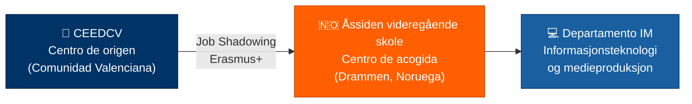

# 1. Datos Generales de la Movilidad

<ExportPDF />

## 1.1 Ficha de la movilidad

| Campo | Detalle |
|-------|---------|
| **Profesor participante** | Guillermo Garrido |
| **Especialidad** | Informática (Formación Profesional) — Desarrollo de aplicaciones web en entorno servidor |
| **Centro de origen** | CEEDCV — Centro Específico de Educación a Distancia de la Comunidad Valenciana |
| **Centro de acogida** | Åssiden videregående skole (Drammen, Noruega) |
| **Departamento a visitar** | Informasjonsteknologi og medieproduksjon (IM) — Tecnologías de la Información y Producción Multimedia |
| **Persona de contacto en destino** | Ana Sieder (Coordinadora de Internacionalización) |
| **Fechas propuestas** | <Badge variant="warning">A completar</Badge> Primavera 2027 (según lo acordado con el centro de acogida) |
| **Programa** | Erasmus+ — Movilidad de personal docente (*Job Shadowing*) |

::: warning-box Fechas pendientes de confirmación
El campo de fechas debe completarse una vez se acuerden con **Ana Sieder**. Hasta entonces se propone, de forma orientativa, la **primavera de 2027**.
:::

## 1.2 Relación entre los centros

## 1.3 Contexto institucional

::: info-box Sobre el CEEDCV
El **Centro Específico de Educación a Distancia de la Comunidad Valenciana** es un centro pionero en la enseñanza *online* de adultos, con una oferta de Formación Profesional impartida íntegramente a distancia. Esta modalidad exige una innovación metodológica constante en la impartición de competencias técnicas.
:::

::: info-box Sobre el Åssiden videregående skole
El **Åssiden videregående skole** es uno de los centros de Formación Profesional más grandes y avanzados de Noruega. Su departamento de **Informasjonsteknologi og medieproduksjon (IM)** imparte formación directamente relacionada con la especialidad del profesor participante: programación, desarrollo web, redes, ciberseguridad y diseño de soluciones digitales.
:::

---

**Siguiente apartado:** [2. Motivos y justificación →](./2-motivos-justificacion)
