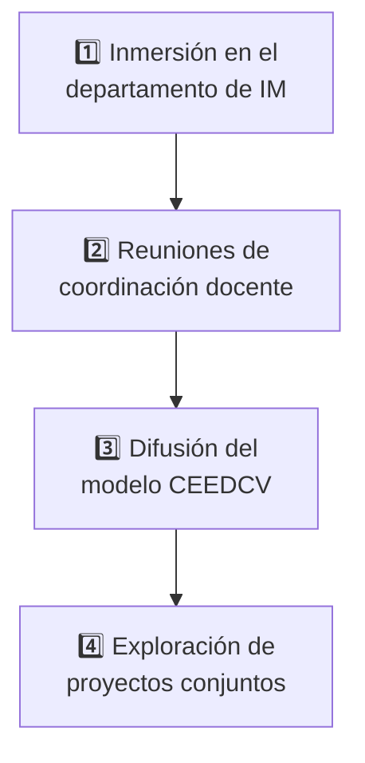

# 5. Plan de Trabajo y Actividades a Realizar

<ExportPDF />

Durante la estancia en **Drammen**, el plan de trabajo se estructura en torno a las siguientes actividades principales, sujetas al horario definitivo del centro de acogida.

## 4.1 Inmersión en el departamento de IM

Asistencia como **observador** a clases técnicas de programación, desarrollo web y redes. Se prestará especial atención a las sesiones impartidas por el **profesor de la especialidad hispanohablante** mencionado por la coordinadora, lo que facilitará el análisis técnico de las dinámicas de aula.

## 4.2 Reuniones de coordinación docente

Encuentros con el equipo educativo del departamento de Informática para intercambiar experiencias sobre:

- El **diseño de materiales** didácticos.
- La **evaluación de proyectos de código**.
- La **gestión de la infraestructura** de prácticas de los alumnos.

## 4.3 Difusión del modelo CEEDCV

Realización de una **presentación formal** sobre el Centro Específico de Educación a Distancia de la Comunidad Valenciana.

::: info-box Doble objetivo de la presentación
Esta actividad se llevará a cabo en las **clases de español** del centro anfitrión y cumple dos fines:

1. Dar a conocer nuestro modelo de **educación online de adultos** en el extranjero.
2. Aportar **valor cultural y lingüístico** al alumnado noruego.
:::

## 4.4 Exploración de proyectos conjuntos

Reunión con la coordinadora internacional, **Ana Sieder**, para definir posibles **proyectos colaborativos a distancia** entre los estudiantes de ambos centros en el ámbito del desarrollo de aplicaciones.

---

**Siguiente apartado:** [6. Prospección de empresas (FCT) →](./6-prospeccion-fct)
