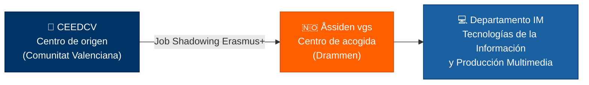
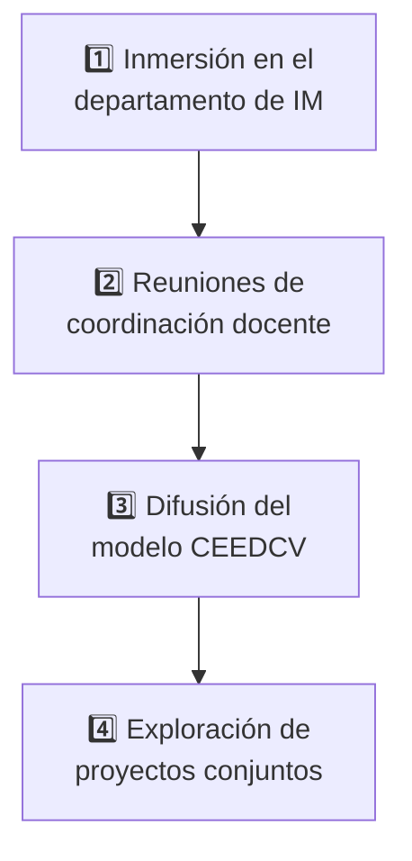

<SlidesViewer>

## 1 · Portada del Proyecto

::: accent-box 🎓 Job Shadowing en Noruega
**Movilidad Erasmus+ del CEEDCV al Åssiden videregående skole**

Observación docente · Contraste metodológico · Prospección de empresas TIC

Drammen, Noruega — Primavera 2027 (orientativo)
:::

---

## 2 · Datos Generales de la Movilidad

::: info-box Ficha de la movilidad

- ✓ **Participante:** Guillermo Garrido — especialidad Informática (FP), desarrollo web en entorno servidor.
- ✓ **Centro de origen:** CEEDCV, Centro Específico de Educación a Distancia de la Comunidad Valenciana.
- ✓ **Centro de acogida:** Åssiden videregående skole (Drammen), departamento **IM** — *Informasjonsteknologi og medieproduksjon*.
- ✓ **Contacto en destino:** Ana Sieder, Coordinadora de Internacionalización.
- ✓ **Programa:** Erasmus+ — Movilidad de personal docente (*Job Shadowing*).
:::

::: warning-box Fechas pendientes
Las fechas definitivas se acordarán con Ana Sieder; se propone de forma orientativa la **primavera de 2027**.
:::

---

## 3 · Relación entre los Centros

::: note-box Cómo leer el esquema
La movilidad conecta al docente del CEEDCV con el Åssiden vgs, y la actividad se concentra en su departamento tecnológico (IM).
:::

---

## 4 · Motivos de la Movilidad

> El Åssiden videregående skole es uno de los centros de Formación Profesional **más grandes y avanzados de Noruega**, con un departamento de Tecnologías de la Información directamente afín a la especialidad del participante.
>
> — *Justificación del destino*

::: accent-box purple 🎯 La necesidad de innovar
Observar cómo un centro presencial de referencia enseña competencias técnicas complejas (arquitectura de servidores, contenedores, desarrollo web) permite **contrastar modelos pedagógicos** y extraer buenas prácticas transferibles a la enseñanza **a distancia** del CEEDCV.
:::

---

## 5 · Áreas de Interés Prioritarias

::: info-box Qué se quiere observar

- **Programación:** metodologías activas y resolución de problemas (*troubleshooting*).
- **Desarrollo web:** frameworks y flujos de trabajo reales de la industria.
- **Redes y ciberseguridad:** enfoque competencial y prácticas de laboratorio.
- **Infraestructura:** virtualización, contenedores y automatización en el aula.
- **Diseño de soluciones digitales:** ABP y trabajo colaborativo.
:::

::: accent-box success ✨ El valor del contraste
Un modelo presencial consolidado frente a un modelo a distancia en construcción permanente: de esa comparación surgen las transferencias más valiosas.
:::

---

## 6 · Innovación e IA: Aprendizaje Adaptativo

El departamento tecnológico de Åssiden vgs lidera **proyectos internacionales de IA** (con intercambios recientes con **Finlandia**) para explorar la IA generativa en el aula.

::: info-box El proyecto: *tilpassa opplæring*

- Objetivo 1: investigar cómo docentes y alumnos usan la **IA en el aula**.
- Objetivo 2: desarrollar un **chatbot / asistente de IA** que genere planes de estudio, textos, recursos visuales y ejercicios adaptados al nivel y estilo de cada alumno.
- Concepto clave: **aprendizaje personalizado o adaptativo** — *tilpassa opplæring* en noruego.
:::

---

## 7 · Alumnado Protagonista

::: accent-box success 🌟 Aprendizaje entre iguales
Los propios estudiantes de Informática y Programación del Åssiden vgs prepararon **encuestas** sobre el uso de la IA y **lideraron workshops de programación** para sus homólogos finlandeses — un modelo de gran valor para nuestro alumnado a distancia.
:::

::: info-box Conexión con el perfil docente

- **Asistentes de código por IA** → optimizar la enseñanza de lenguajes de servidor y arquitectura de software.
- **Automatización** → mejorar flujos de trabajo en los módulos de desarrollo.
- **Prompting** → diseñar materiales y ejercicios más ricos para la formación online.
:::

---

## 8 · Objetivos de la Movilidad

::: tabs

== 🔍 Observación metodológica

Analizar las metodologías activas del profesorado noruego en el aula de informática:

1. Resolución de problemas (*troubleshooting*).
2. Aprendizaje basado en proyectos (ABP).
3. Trabajo colaborativo en entornos de desarrollo.

== 📚 Análisis curricular

Conocer el currículum técnico noruego en desarrollo de software y sistemas: frameworks *frontend/backend*, virtualización y contenedores, y herramientas de automatización e integración continua.

== ⚖️ Contraste de modelos

Identificar estrategias de **motivación, retención y evaluación** del alumnado de FP presencial para evaluar su adaptación a los módulos a distancia del CEEDCV.

:::

---

## 9 · Presencial vs. Distancia

::: accent-box info ⚖️ Comparativa de modelos
| Dimensión | Presencial (Noruega) | Distancia (CEEDCV) |
|-----------|----------------------|--------------------|
| **Motivación** | Presencia física, dinámica de grupo | Tutorización asíncrona, autonomía |
| **Retención** | Seguimiento continuo en aula | Alertas tempranas de abandono |
| **Evaluación** | Proyectos y observación directa | Rúbricas y evidencias digitales |
:::

::: tip-box Internacionalización Erasmus+
Consolidar la relación CEEDCV ↔ Åssiden vgs para futuros intercambios de buenas prácticas *online* y movilidades de alumnado y profesorado de la familia de Informática.
:::

---

## 10 · Plan de Trabajo

::: note-box Actividades sujetas al horario del centro de acogida
El plan definitivo se cerrará con la coordinadora internacional, Ana Sieder.
:::

---

## 11 · Actividades en Detalle

::: tabs

== 🏫 Inmersión en IM

Asistencia como observador a clases técnicas de programación, desarrollo web y redes, con atención especial a las sesiones del profesorado hispanohablante de la especialidad.

== 🤝 Coordinación docente

Intercambio sobre diseño de materiales didácticos, evaluación de proyectos de código y gestión de la infraestructura de prácticas del alumnado.

== 🇪🇸 Difusión del CEEDCV

Presentación formal del modelo de educación online de adultos en las **clases de español** del centro anfitrión: doble valor educativo y cultural.

== 🚀 Proyectos conjuntos

Reunión con Ana Sieder para definir proyectos colaborativos a distancia entre el alumnado de ambos centros en desarrollo de aplicaciones.

:::

---

## 12 · Prospección de Empresas (FCT)

::: accent-box primary 🌍 Área de acción: Drammen + Oslo
Drammen y Oslo forman prácticamente un **área metropolitana continua** (~34 min en tren). La prospección abarcará el principal *hub* tecnológico del país, con empresas que trabajan en inglés como idioma vehicular.
:::

::: info-box Estrategia en dos fases

- **Vía institucional (prioritaria):** colaboración de la coordinación de Åssiden vgs y su red de empresas del sistema de FP dual noruego.
- **Vía directa (complementaria):** visita activa a estudios y consultoras del área metropolitana con tecnologías afines a nuestro currículo.
:::

---

## 13 · Empresas Identificadas

::: tabs

== 🏢 Atea Drammen

Gran corporación nórdica de infraestructura y consultoría TI. Redes, sistemas, ciberseguridad. Capacidad estructural para acoger alumnado en prácticas.

== 💻 Addovation AS

Software empresarial: automatización, ERP (Oracle NetSuite), integración. Ideal para perfiles de programación *backend* y soluciones B2B.

== 📊 Gapit Nordics AS

Datos de infraestructuras industriales, IoT, visualización y monitorización. Para perfiles de sistemas avanzados y análisis de métricas.

== ☁️ Cloud Connection AS

Servicios gestionados de TI y migraciones a la nube. Despliegue web, virtualización, *backups* y automatización de servidores.

== 🌐 Index Development

Agencia de desarrollo web *full-stack* a medida. Conexión directa con nuestras especialidades docentes y el ciclo de vida completo de una aplicación.

:::

---

## 14 · Impacto y Difusión

::: info-box Transferencia al CEEDCV

- → **Departamento de Informática:** difusión de buenas prácticas y materiales observados.
- → **Coordinación Erasmus+ (Sergio Martínez):** documentación de contactos y aprendizajes.
- → **Currículo:** actualización de materiales, casos prácticos y metodologías de evaluación según las demandas del mercado escandinavo.
:::

::: accent-box success 🚀 Aprovechamiento de los fondos europeos
El impacto no se queda en la observación docente: busca un **beneficio directo** para el futuro laboral e internacional del alumnado — enriquecer la oferta formativa a distancia y fortalecer la dimensión europea del centro.
:::

---

## 15 · Cierre y Pasos Siguientes

::: accent-box 🎓 Hacia una colaboración estable
**¿Qué hacer a partir de ahora?**

Próximos pasos · Cerrar las fechas de la movilidad con Ana Sieder

Antes del viaje · Completar el apartado de fechas en la documentación para la GVA

A largo plazo · Convertir esta primera toma de contacto en una **relación institucional estable** Erasmus+
:::

</SlidesViewer>
